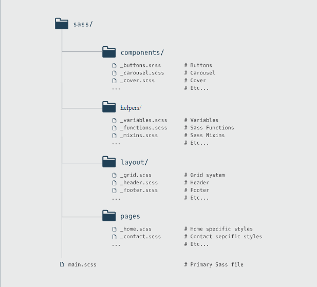

# Entry 4: Sustainable SCSS

In the fourth week, I am finally finishing off Codecademy and will be able to move on to other resources next week. In this week, I tried to create a little project of my own on JS Bin with everything that I have learn in the past weeks. This will be the best way for me to close up my learnings in Codecademy.



## @import
Rules for @import:
1. All imported SCSS files are imported into main SCSS file that is combined to make a single CSS output file.
2. The main SCSS file has access to any variable or mixins defined in the imported files. ``` `@import``` command takes a filename to import

Typically, ```@import``` looks for a SASS file in the name; but there are circumstances where it will behave just like a CSS @import rule:
1. If the file’s extension is .css.
2. If the filename begins with http://.
3. If the filename is a url().
4. If the ```@import``` has any media queries.

Importing files can keep code organized and can save me from repeating code. For example, if multiple SCSS files reference the same variables, importing a file with variables would save the trouble of redefining them each time.

## Partials
Partials are the files that is split up to organize specific functionality in the codebase. 

1. The ```_``` prefix notation in the file name that tells Sass to hold off on compiling the file individually and instead import it: 

```CSS
_filename.scss
```

2. To import this partial into the main file take out the underscore. For example, to import a file named _variables.scss, add the following line of code:

```CSS
  @import "variables";
```
## @extend
```CSS
<span class="lemonade"></span>

<span class="lemonade strawberry"></span>
```
If you want the styles of one class to be applied to another in addition to its own individual styles by using the above code, then there will be a bug in maintainability. The reason is because then both classes always have to be included in the HTML in order for the styles to be applied.

But ```@extend``` helps fix this. All we need is to make the strawberry class extend ```.lemonade```:

```CSS
.lemonade {
  border: 1px yellow;
  background-color: #fdd;
}
.strawberry {
  @extend .lemonade;
  border-color: pink;
}
```

As appeared in the above chunk of code, you can just simply add the declaration of ```@extend .lemonade``` inside the ```.strawberry``` selector. 

The above code compile into:
```CSS
.lemonade, .strawberry {
  border: 1px yellow;
  background-color: #fdd;
}

.strawberry {
  @extend .lemonade;
  border-color: pink;
}
```

## %placeholders
Placeholder behaves like a class or id selector but you use ```%``` instead of ```#``` or ```.```. Placeholders prevent rules from being given to CSS on their own and only become active once they are extended anywhere an id or class could be extended.

```CSS
a%drink {
    font-size: 2em;
    background-color: $lemon-yellow;
 }

 .lemonade {
  @extend %drink;
  //more rules
 }
```
This would translate to:
```CSS
  a.lemonade {
    font-size: 2em;
    background-color: $lemon-yellow;
 }

.lemonade {
  //more rules
}
```

## @Extend vs @Mixin
Mixins insert the code inside the selector's rules wherever they are included(refer to entry 2 for more information). 

Structure for ```@mixin``` and ```@extend```: 
```CSS
@mixin no-variable {
  font-size: 12px;
  color: #FFF;
  opacity: .9;
}

%placeholder {
  font-size: 12px;
  color: #FFF;
  opacity: .9;
}

span {
  @extend %placeholder;
}

div {
  @extend %placeholder;
}

p {
  @include no-variable;
}

h1 {
  @include no-variable;
}
```

This compile into:
```CSS
span, div{
  font-size: 12px;
  color: #FFF;
  opacity: .9;
}

p {
  font-size: 12px;
  color: #FFF;
  opacity: .9;
  //rules specific to ps
}

h1 {
  font-size: 12px;
  color: #FFF;
  opacity: .9;
  //rules specific to ps
}
```

## First Try
Like I mention before, I try to code something small with what I learned for the past weeks. The following link is the small project I created:

https://jsbin.com/ridulifami/edit?html,css,output

This project is really simple. But I was able to put the things that I learned into this. I was trying to figure out what I can potentially do with SASS. For this project, I have to refer back to my past blog posts very often. Because it was a long time ago, I forgot most of the stuff, but fortunately, I commented my code(an explanation of each line of code) and a paragraph after the code that I am confused with to explain what it does.

## Takeaways
1. Always add explanations to your codes, so you will have a sense of what it does. And this way, when you come back to the code in the future, you will be able to know what it does.
2. If you have no idea with what you want to create for the project. Try to put everything you learn all together and see what you can do with these code. This might be a starting point for you to see what you can create in your learning zone.


