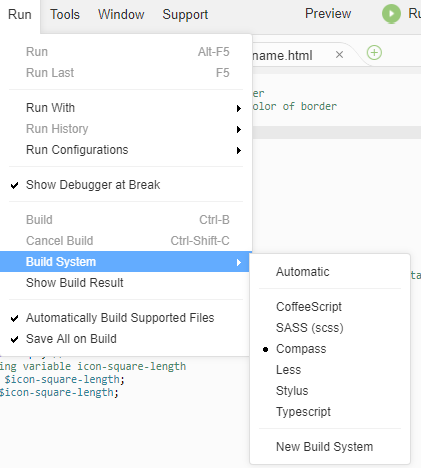

# Entry 5: Starting the Independent Study Final Project

Since I have finished all the topics that I am suppose to learn for SASS on Codecademy, it is time to start my final project. But first, I have to brainstorm idea(s) for this project. Since SASS is like CSS, my only option is to use it to decorate the website. I decided to pick out an old website that I created and decorate it better with SASS. For this project, I decided to work on it with two of my classmates.

## Finding Platforms to Code SASS
1. JS Bin (https://jsbin.com/?html,output)
* Flaw: One flaw to this platform is that it is impossible to allow multi-users code on the same project at the same time, so this discourage group work. Also, once I share the link to someone else, the person cannot edit the code using the same link because it will not save the code. He/she is required to copy and paste the codes in another JS Bin link; and this is inconvenient because it takes up so much time especially when we have a deadline to the project, we cannot waste any time.
2. Cloud 9 (https://c9.io/)
* Flaw: In order to code in SASS in c9, the setup for the files will be complicated. I have to create a new folder that stores all the code for the final project: one file for SASS and another for HTML. Afterwards, I have to find a way that I can connect the two files together.

Even though, c9 is complicated to set up than JS Bin, it makes the most sense to use for this project because I am going to work on this with another 2 people. Plus, we have been used to using c9 in class for mostly every project, so there would not been a rough transition compare to JS Bin. Therefore, c9 is my choice.

## Setup for SASS on c9
First thing first, I have to compile SASS to CSS on c9 in order for SCSS to be able to run. So I started off with goggling “SASS on c9”. The first result that I got was “Compile SCSS to CSS - Cloud9 Support - Cloud9 Community”. This website gives me the idea that I need to install compass in c9, so the next thing I searched up was “install compass on c9”. Then I clicked on the second result which is “Trying to compile SASS to a different directory - Cloud9 Community”. This website gave clear instructions as to installing compass on c9.

### What is Compass?
Compass is a SASS framework that makes the work of styling the web smooth and efficient.

### Installing SASS on c9
1. In the command line of c9, type ```cd .c9```, then type in ```mkdir builders``` then ```cd``` into it, then type ```touch compass.build```. Open the file with ```c9 compass.build```. Type in the following code in the file:
```
{
    "cmd" : [
        "bash",
        "--login",
        "-c",
        "compass compile /home/ubuntu/workspace/theme"],
    "env" : {},
    "info" : "Compiling SASS in theme directory...",
    "selector": "source.scss"
}
```
2. Create a new file called ```config.rb``` and type in the following code in this file:
```
environment = :development
firesass = false

# Location of the theme's resources.
css_dir         = "css"
sass_dir        = "sass"
extensions_dir  = "sass-extensions"
images_dir      = "images"
javascripts_dir = "js"

output_style = (environment == :development) ? :expanded : :compressed
relative_assets = true
sass_options = (environment == :development && firesass == true) ? {:debug_info => true} : {}
sourcemap = true
```
3. Click on RUN, then go down to BUILD SYSTEM then click on COMPASS and you are done.



### Plans for next week
1. Finish setting up the files (HTML and SASS) for c9 and connect the two files
2. Find a project that I want to improve on and have a plan of what I want to change about it with SASS

## Takeaway
1. When you are researching something, search up the broad question like how I search up "SASS on c9" then go specific with the results. For example, I found a result with "Compile SCSS to CSS - Cloud9 Support - Cloud9 Community", I was able to get closer to my answer by searching "install compass on c9" which was mention in the post. So, if you are not sure how to reseach something, you can be a little vague on it then slowly using the results, be more specific with what your research question and you will find yourself a little closer to the answer.