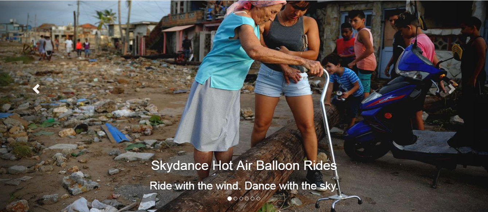
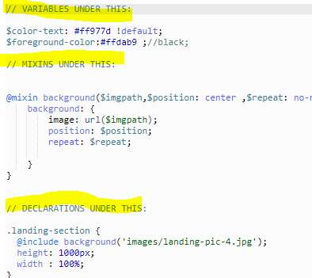

# Entry 8: Almost There...

One more week to go... This week was the most stressful week. As you probably seen in last week's entry, we still have to do a lot of final touches to the website. It is finally coming together, but we are still dissatisfied with the design of it. So this whole week was mostly trying to find ways to make this website look more elegant. And on top of that stress, me and my group members encountered some other problems with our code. So this week did not go as smooth as we imagine it to be.

## Challenges throughout the process
1. Like I mentioned in my last entry, the way that we work on this project is that each of us takes one part of the website and work on it. We thought this will be most efficient way, but it turns out that we were wrong. We kept on adding codes of our own part that the entire code file becomes so disorganized. So in order to solve this problem, we decided to group the codes into 3 categories: Variables, Mixins, and Declarations (or rules). 

2. The second problem that we faced was not being able to make the gallery the way that I mentioned last week. Originally, I wanted the gallery to have all the pictures list out side by side and when the mouse hovers over the images, the image will become transparent and a text box will pop up. We did find a reliable source that can help us with that (http://aaronrutley.com/flexible-and-responsive-gallery-with-sass/). But one problem with that is that once the website changes size (like shrinking the site), the divs in the next section (after the gallery section）will stack on top of the images. Therefore, we had to give up on the traditional gallery design and stick with the carousel because we were afraid that we will not have enough time to fix that problem.

## Next steps:
1. Change the context of the website that is relevant to our topic address in the site.
2. Change the font size and style of the words.

## Takeaway(s):
1. Google is your bestfriend. This week I have to figure out how to make my original plan for the gallery to come true, so I have to do a lot of googling with this certain type of gallery and its SASS code to make it happen.
2. Take a break. When I was facing each of the challenges this week, I find myself becoming impatient and upset. The reason is because I know that I was running out of time and these obstacles will just slow our process down, so I was getting worried. But after taking a break, I find myself more relax and can focus better on my project.

